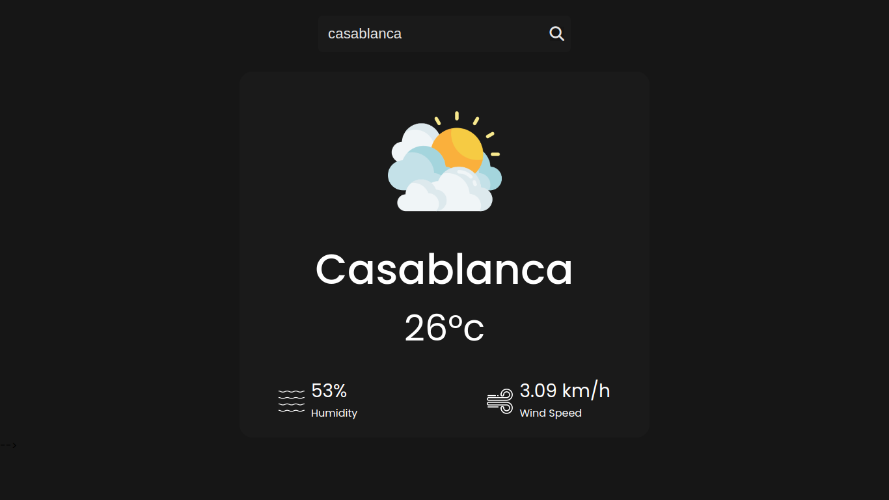

# Mini Weather app

<h3 style="text-align:center; background-color: #161616; width: auto;">Preview of the app</h3>

## About the app

This is a Mini Weather App built using JavaScript that provides current weather information for a specified location. Please note that this project is still a work in progress, and further development and improvements are planned.

## Features

- Displays current weather information for a specified location.
- Ability to Search for cities
